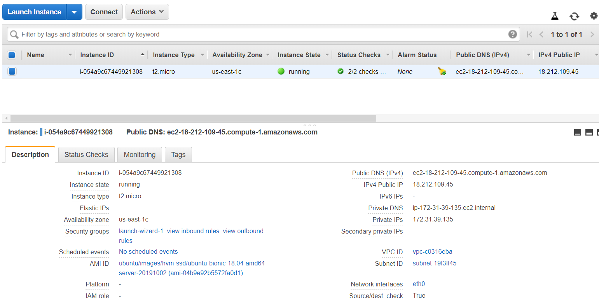
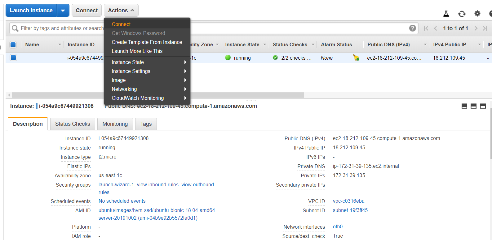
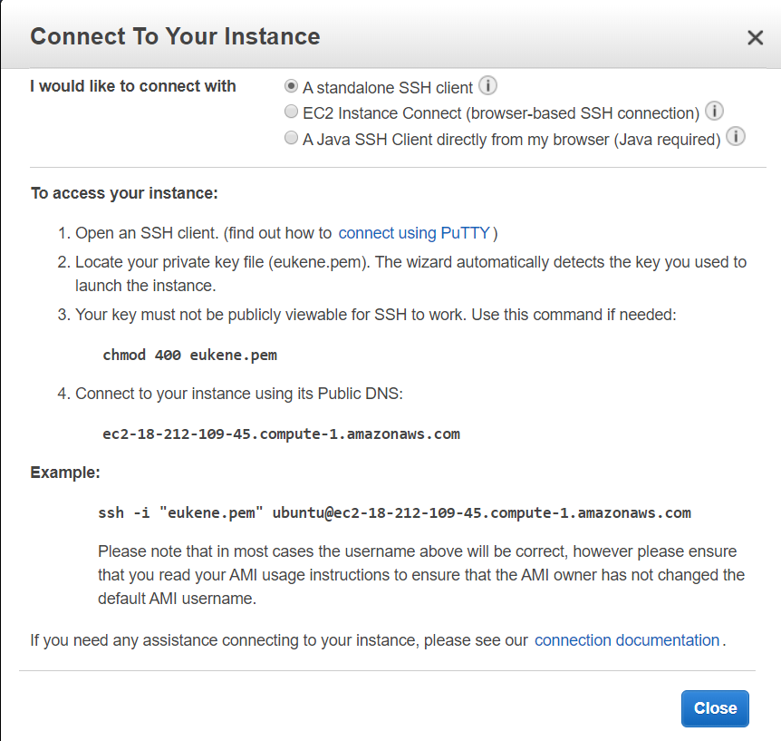
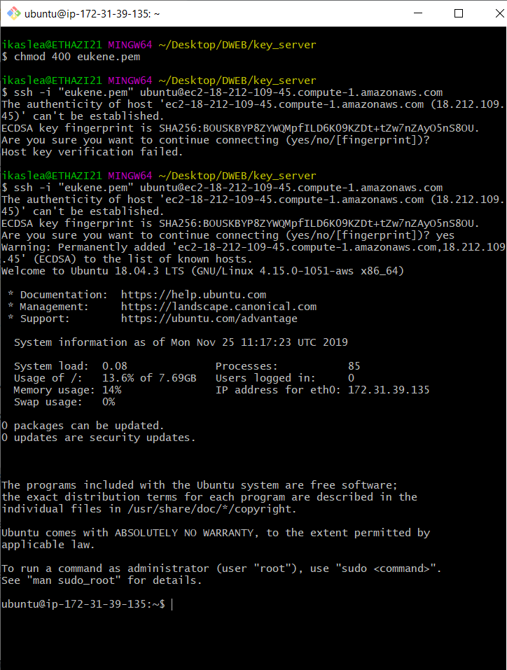
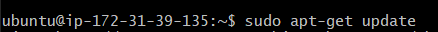
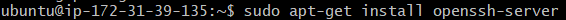
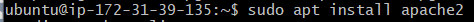
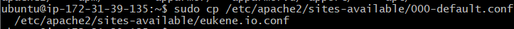
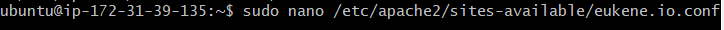
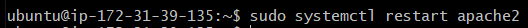

# INSTALAR UBUNTU EN UN SERVIDOR Y CONECTARNOS VIA SSH

Podemos comprobar con la siguiente imagen que el servidor esta encendido y que funciona correctamente.

Para conectarnos a la máquina virtual creada anteriormente, tendremos que ir a Actions->Connect.

Con la clave creada anteriormente, cuando creamos la máquina virtual, deberemos darle los permisos necesarios y después nos podremos conectar copiando la línea de comando que nos ponen como ejemplo.

Lo haremos desde la carpeta donde está la key guardada.

# HABILITAR SSH E INSTALAR APACHE2 

Actualizamos el servidor.

Instalamos los servicios de ssh.

Reiniciamos los servicios de ssh.

Volvemos a actualizar.

E instalamos el apache2.

Creamos un archivo igual que 000-default.conf y le cambiamos el nombre por eukene.io.conf.

Entramos en el archivo que acabamos de crear.

Ahora añadiremos un par de lineas para indicar a ruta.

Y reiniciamos el servicio de apache2.

