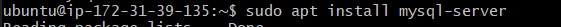
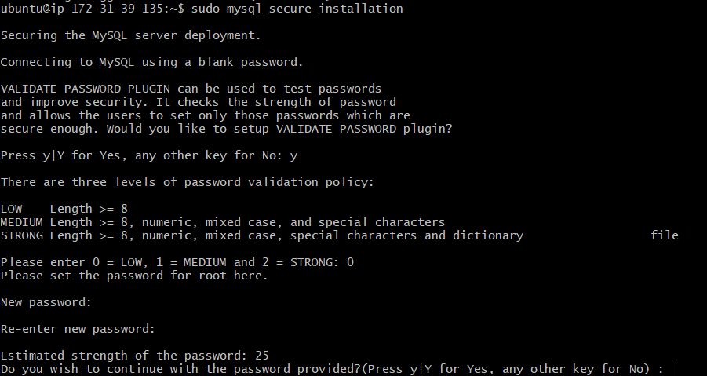
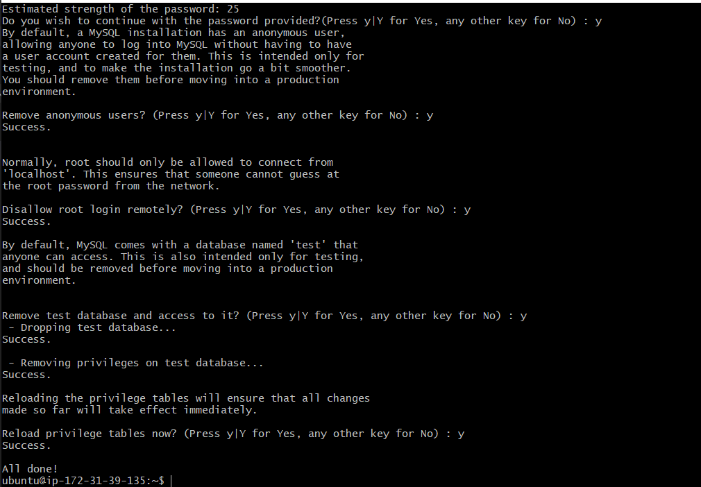
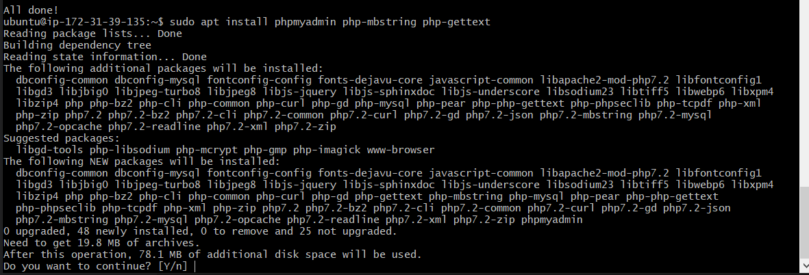
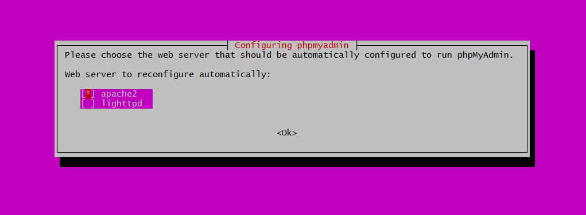
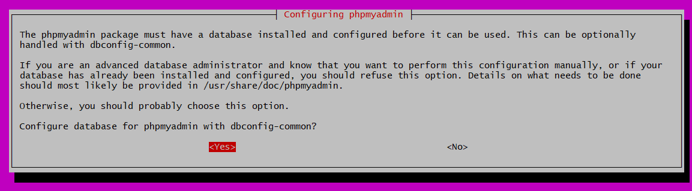
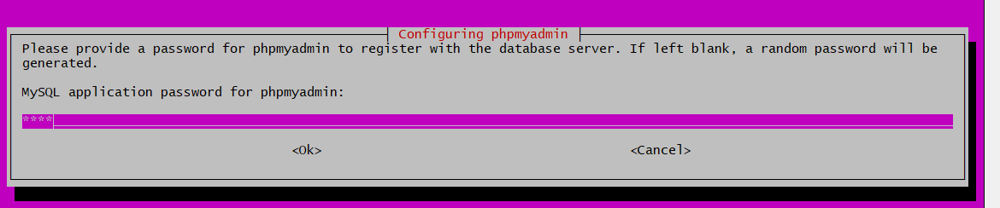
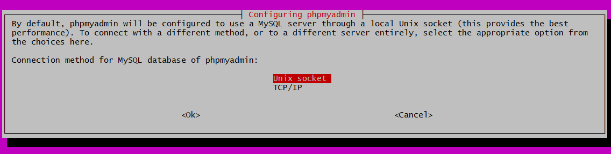
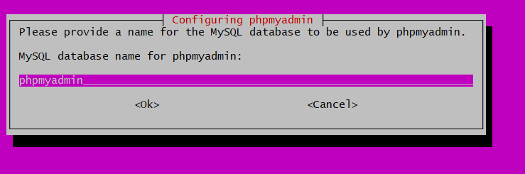
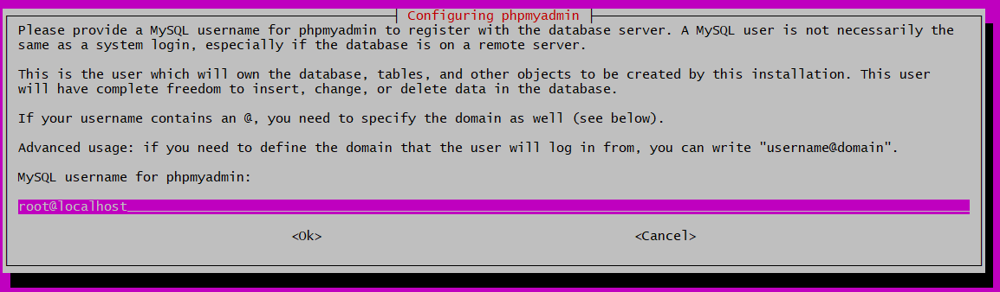

# INSTALAR UBUNTU EN UN SERVIDOR Y CONECTARNOS VIA SSH

Podemos comprobar con la siguiente imagen que el servidor esta encendido y que funciona correctamente.

Para conectarnos a la máquina virtual creada anteriormente, tendremos que ir a Actions->Connect.

Con la clave creada anteriormente, cuando creamos la máquina virtual, deberemos darle los permisos necesarios y después nos podremos conectar copiando la línea de comando que nos ponen como ejemplo.

Lo haremos desde la carpeta donde está la key guardada.

# HABILITAR SSH E INSTALAR APACHE2 

Actualizamos el servidor.

Instalamos los servicios de ssh.

Reiniciamos los servicios de ssh.

Volvemos a actualizar.

E instalamos el apache2.

Creamos un archivo igual que 000-default.conf y le cambiamos el nombre por eukene.io.conf.

Entramos en el archivo que acabamos de crear.

Ahora añadiremos un par de lineas para indicar a ruta.

Y reiniciamos el servicio de apache2.

# MYSQL Y PHP 

Instalamos el servidor de mysql.

Aquí definimos la constraseña y otras cosas de seguridad de mysql.

Vamos a instalar php en la máquina virtual.

Le decimos que usaremos apache2 para ejecutar phpMyAdmin.

Le diremos que si para poder configurar manualmente la administración de la base de datos.

Pondremos una contraseña, en nuestro caso será 1234.

Elegimos Unix Socket, ya que esto proporciona el mejor rendimiento.

Llamaremos a la base de datos phpmyadmin.

Por último le diremos que el usuario con el que se va a conectar sera con root.

