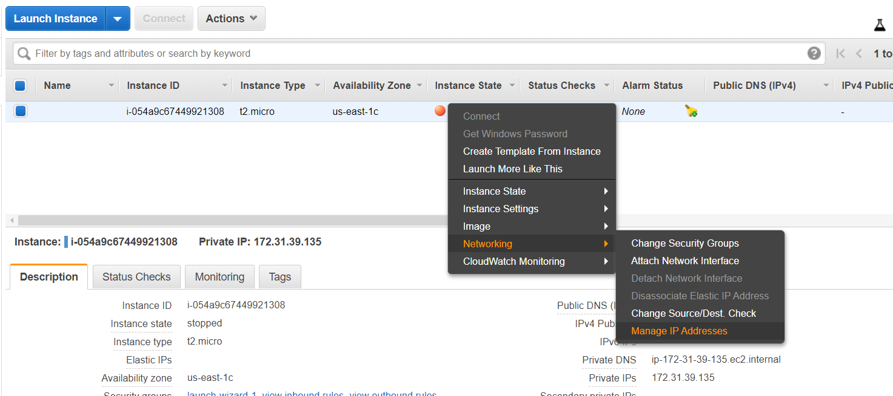
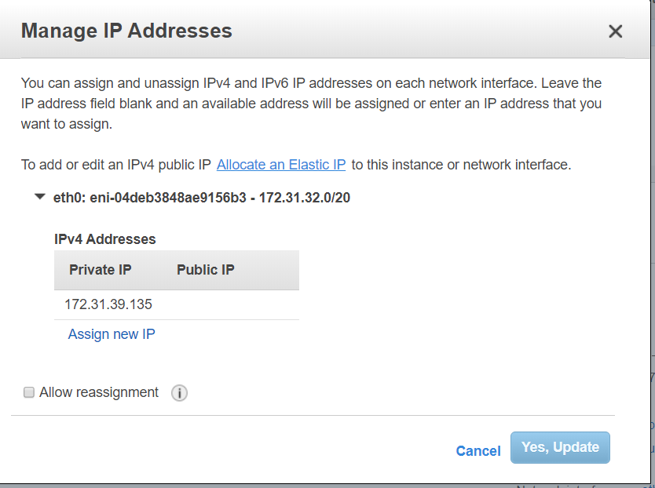
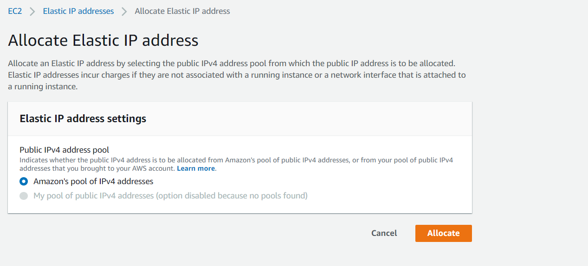
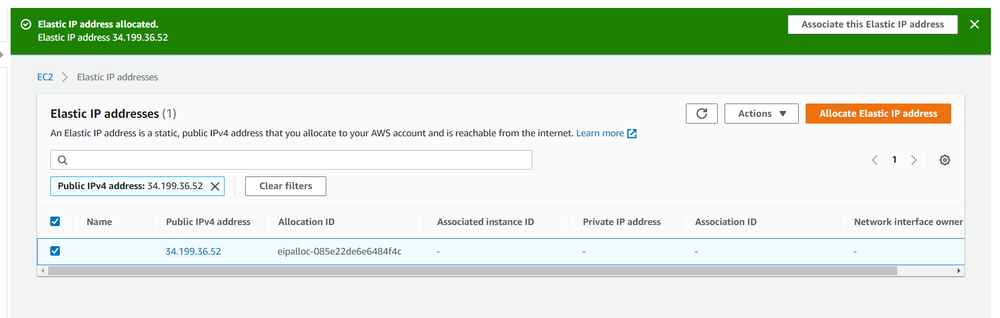
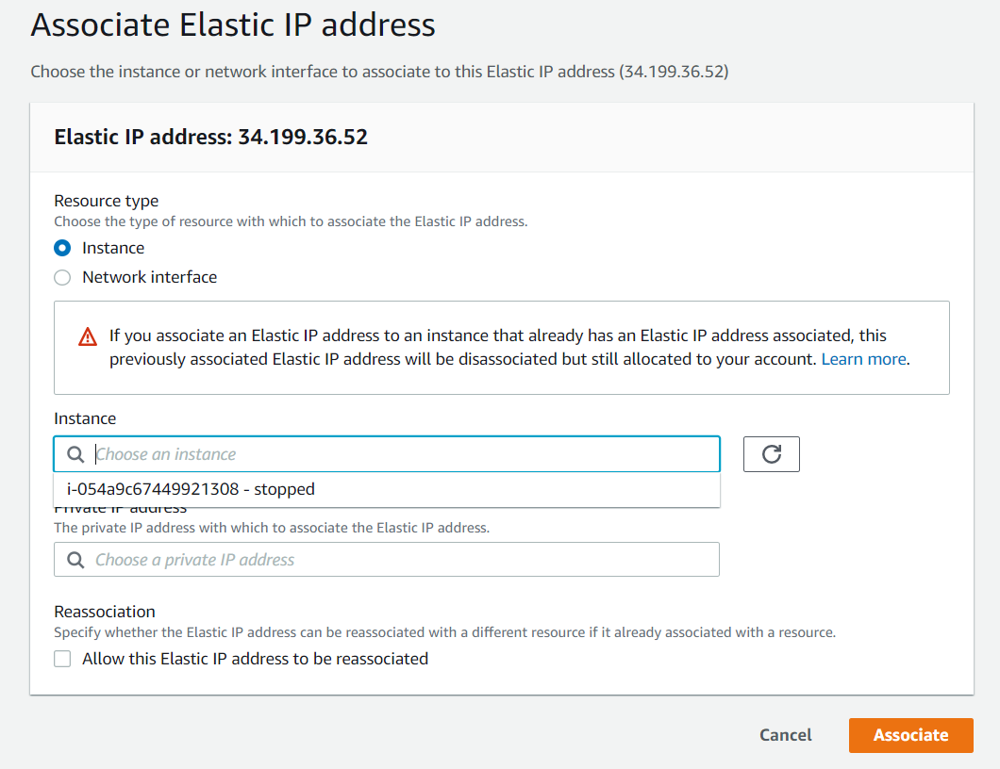
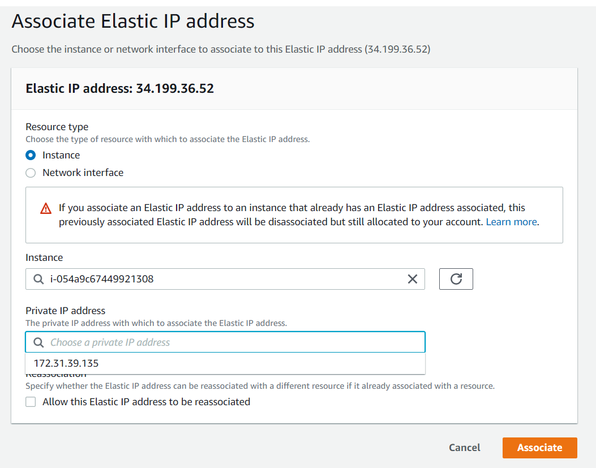
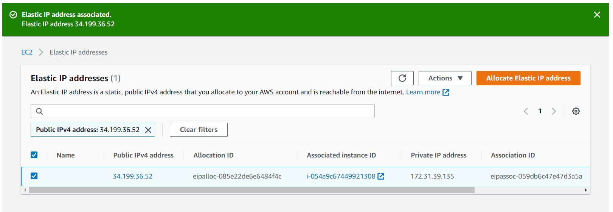
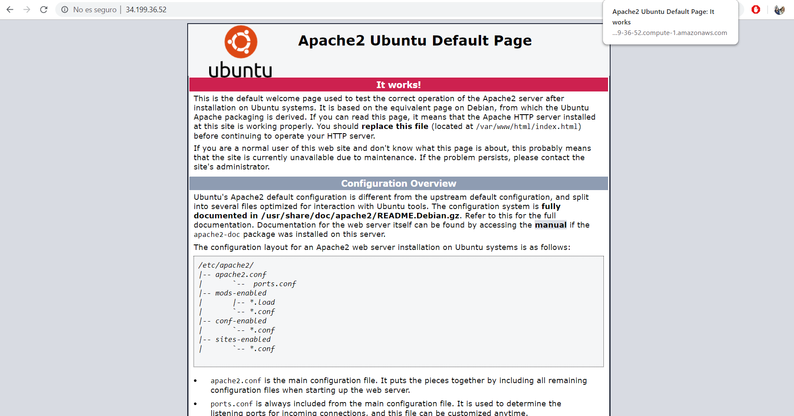

# CREAR Y ASIGNAR ELASTIC IP

Para acceder a la elastic ip, debemos hacer click derecho en la máquina que deseemos e iremos a Networking >> Manage IP Addresses.

Nos aparecerá la siguiente ventana y clickaremos en el link de Allocate an Elastic IP.

Ahora elegiremos Amazon's pool of IPv4 addresses y clickamos en Allocate.

Ahora que hemos creado la Elastic IP, la asignaremos a la máquina virtual que queramos clickando en Associate this Elastic IP address.

Ahora seleccionaremos la máquina que queramos, en nuestro caso solo tenemos una así que elegiremos esa.

Seleccionaremos la IP privada de esa máquina, clickaremos en la casilla de Allow this Elastic IP address to be reassociated y clickaremos en Associate para terminar de asignar la IP elastica a la máquina virtual.

Nos saldrá lo siguiente, diciendo que se ha asociado correctamente:

Si ponemos la dirección IP de la máquina virtual a la que le hemos asignado la IP elastica.

