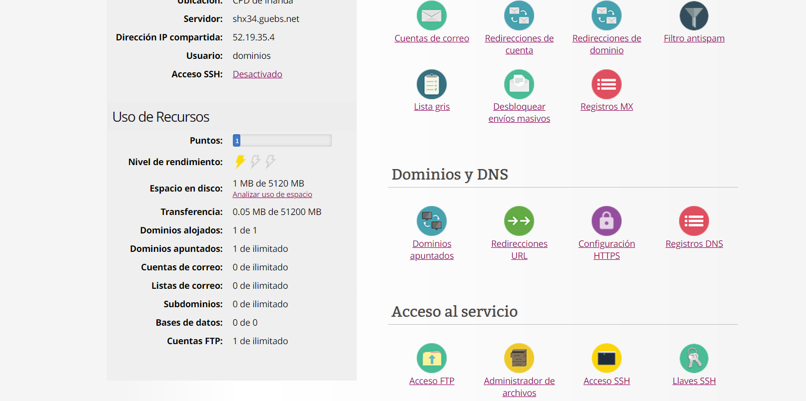
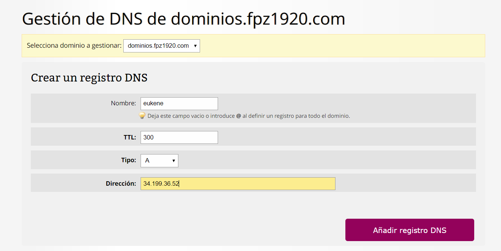
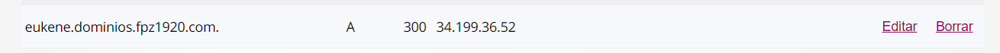

# Crear subdominio

Para poder crear un subdominio hay que entrar en el gestor de servicios e ir a registros DNS.

Cuando nos aparezca en pantalla la siguiente ventana haremos lo siguiente: 
1. En Nombre pondremos el nombre que queramos que lleve el subdominio. 

2. En TTL (tiempo de vida) pondremos 300ms.

3. En Tipo pondremos que es tipo A porque este registro se usa para traducir nombres de servidores de alojamiento a direcciones IPv4.

4. En Dirección escribiremos la dirección de la página que quieras. En nuestro caso la IP elástica que creamos anteriormente.

Podremos observar en la misma página al final, que se ha creado correctamente.

# TIPOS DE DNS

- A : Se utiliza cuando queremos conectar un dominio o subdominio a una direccion IP de un servidor(IPv4).
- AAAA : Se utiliza cuando queremos  conectar un dominio o subdominio a una direccion IP de un servidor(IPv6).
- CNAME : Permite apuntar un dominio hacia un nombre de servidor. Por ejemplo: si en dirección ponemos prueba.com y el dominio es www.prueba.com, habiendo creado antes el dominio prueba.com, cuando escribamos www.prueba.com, nos llevará al sitio donde esta prueba.com.
- SRV :  Se utiliza para la configuración de servicios como Office 365 de Microsoft y para algunos protocolos XMPP, SIP o LDAP. 
- TXT : Proporciona información de texto a fuentes externas al dominio.
