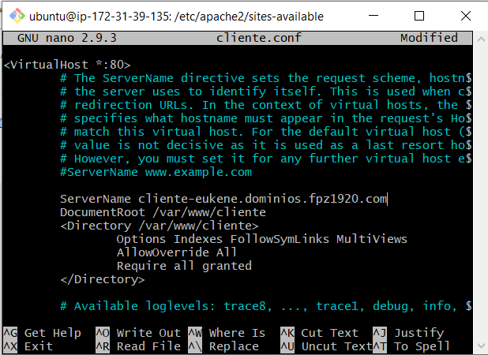
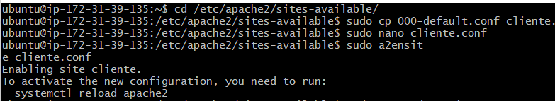
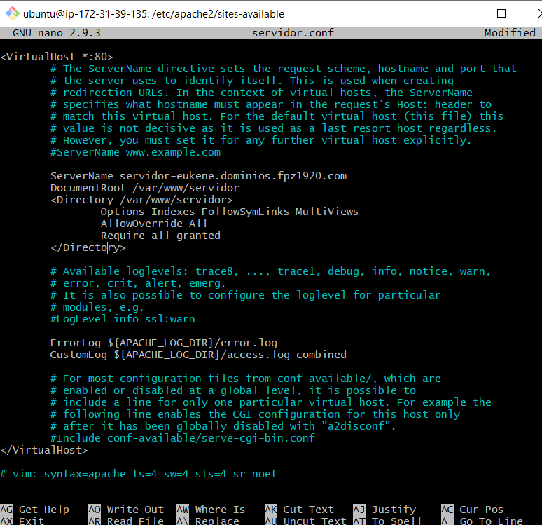
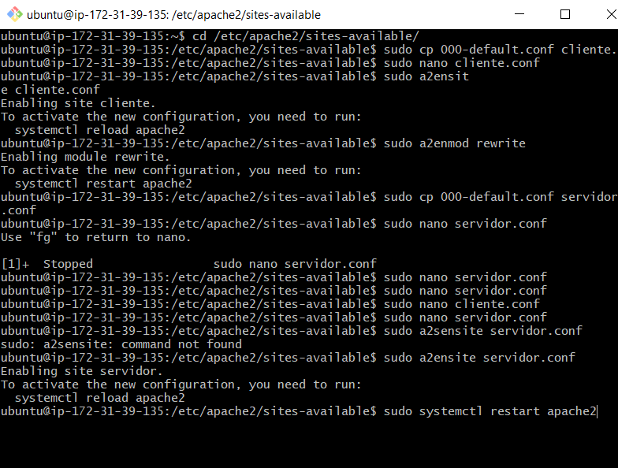
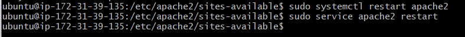
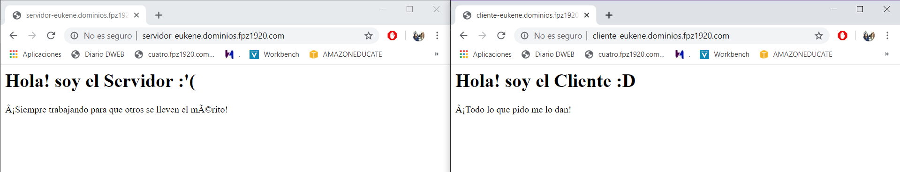

# TAREA 4: Virtual Hosts

Primero vamos a crear una copia de 00-default.conf. 

Entramos en el archivo (utilizando nano) y vamos a indicarle la URL que tenemos que poner en el navegador(ServerName) y donde están situados los archivos de nuestra carpeta de cliente.
En nuestro caso están en /var/www/cliente.

A continuación, habilitaremos la URL mediante el comando "sudo a2ensite cliente.conf".

Con servidor seguiremos los mismos pasos que con cliente.

Para terminar reiniciaremos el servidor usando los siguientes comandos:

Y poniendo en nuestro navegador las direcciones nos saldrá lo escrito en el index.html de cada carpeta (cliente y servidor).
