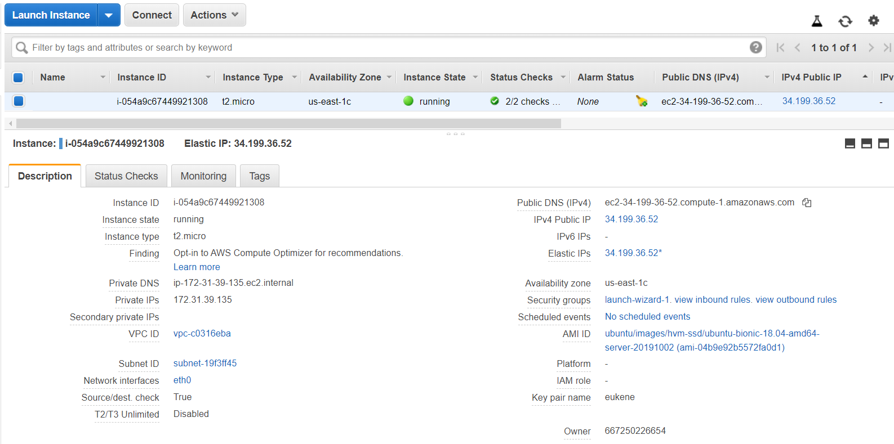
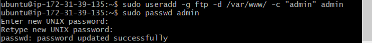
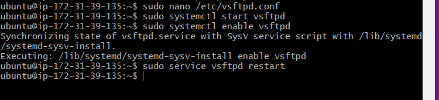

# TAREA 5: Servidor FTP

Vamos a launch-wizard-1.

Añadimos el puerto 21.

Instalamos el ftp en el servidor.

Creamos los usuarios cliente,servidor y admin y les asignamos sus carpetas.

Accedemos al archivo ftp.

Y añadimos las siguientes lineas:

Reiniciamos y habilitamos el servicio ftp.

Cambiamos de modo pasivo a activo en WinSCP.

Y conectamos con el usuario admin.

