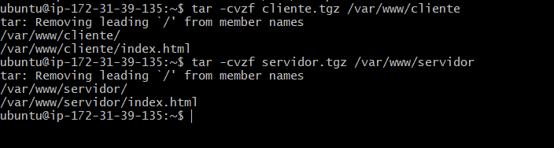

# TAREA 6

Cromprimimos las caprteas de cliente y servidor.

Comprobamos que se han creado correctamente.

Comprobamos el estado de nuetro mysql.

Creamos la base de datos con el nombre BaseDeDatosNueva con el usuario root.

Creamos la copia de la base de datos que habiamos creado anteriormente.

Comprobamos si se ha creado correctamente utilizando el comando ls.

