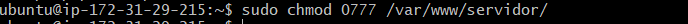

# TAREA 7

Hemos creado la carpeta copiaSeguridad donde guardaremos los archivos para que se creen las copias de seguridad automaticamente.

Creamos los archivos script.php y script.sh.

En el documento script.sh le diremos que haga copia de seguridad con el nombre de la fecha del dia de ejecución de la base de datos y de las carpetas cliente y servidor.

Luego vamos al archivo creado script.php y le indicamos que tiene que ejecutar el script creado anteriormente.

Metemos en la carpeta de las copias de seguridad los archivos que hemos creado.

Cambiamos de lugar el archivo script.php para ponerlo en el servidor y le damos permisos, tanto a la carpeta de servidor como a la carpeta de la copia de seguridad y el cambiamos el usuario.

